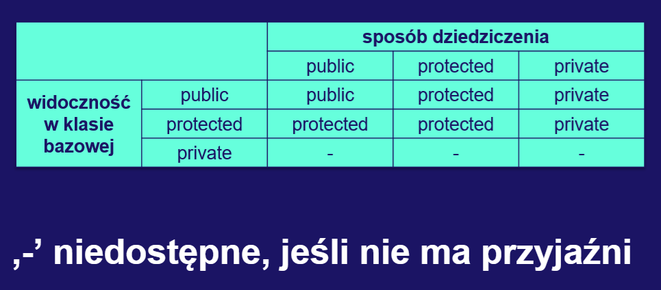

# **Egzamin licencjacki - opracowanie pytań**

### Do lepszego ogarnięcia/zrobienia:
- java: JDBC,
- dyskretna:
  - dodać algorytm łączenia w pary,
  - dodać rachunek różnicowy i liczenie przez części,
- ~~wdak: dodać rolę przerwań~~

### **Java**
[1. Co to jest klasa abstrakcyjna i interfejs w Javie.](#java1) <br>
[2. Proszę omówić dostępne sposoby synchronizacji wątków w Javie.](#java2) <br>
[3. Czy Java jest językiem kompilowanym czy interpretowanym?](#java3) <br>
[4. Co to jest JDBC?](#java4) <br>
[5. Co to jest serializacja? Jak zrealizować serializację w Javie?](#java5) <br>

### **Bazy danych**
[1. Normalizacja baz danych - jej cel i wpływ na wydajność.](#bazy1) <br>
[2. Klucze główne, obce i wyzwalacze.](#bazy2) <br>
[3. Transakcje i zasady ACID.](#bazy3) <br>

### **Język Python**
[1. Programowanie obiektowe w języku Python.](#pyhton1) <br>
[2. Tworzenie i korzystanie z wyjątków w języku Python.](#python2) <br>
[3. Type zmienne i niezmienne, hashowalne i niehashowalne w Pythonie.](#python3) <br>

### **Język C++**
[1. Co to jest konstruktor i destruktor?](#cpp1) <br>
[2. Jakie znasz typy dziedziczenia?](#cpp2) <br>
[3. Podaj przykład kontenerów sekwencyjnych.](#cpp3) <br>

### **Matematyka dyskretna**
[1. Twierdzenie Halla i algorytm łączenia w pary.](#md1) <br>
[2. Omów metody obliczania sum skończonych.](#md2) <br>
[3. Trójkąt Stirlinga (dla podziałów) i liczby Bella.](#md3) <br>

### **Algorytmy i struktury danych I**
[1. Lista - definicja, sposoby reprezentowania.](#asd1_1) <br>
[2. Złożoność obliczeniowa.](#asd1_2) <br>
[3. Drzewa, drzewa binarne, algorytmy przeglądania drzew: inorder, postorder, preorder.](#asd1_3) <br>


### **Algorytmy i struktury danych II**
[1. Grafy - definicja, sposoby reprezentowania grafu.](#asd2_1) <br>
[2. Algorytmy przeszukiwania grafu BFS i DFS.](#asd2_2) <br>
[3. Algorytm Dijkstry.](#asd2_3) <br>

### **Wstęp do architektury komputerów**
[1. Elementy rozkazu maszynowego i cykl wykonania rozkazu.](#wdak1) <br>
[2. Rola przewań.](#wdak2) <br>
[3. Główne cechy architektury komputerów von Neumana.](#wdak3) <br>

### **Podstawy informatyki**
[1. Wymień i scharakteryzuj poznane metody programowania. Dla każdej metody podaj przykładowy problem i sposób jego rozwiązania.](#pi1) <br>
[2. Co oznacza, ze algorytm jest częściowo poprawny, ma własność STOPu oraz kiedy mówimy, że algorytm jest całkowicie poprawny?](#pi2) <br>
[3. Porównaj język maszynowy, język symboliczny i języki programowania wysokiego poziomu. Dlaczego mamy tak wiele języków programowania i co je różni?](#pi3) <br>

### **Język C**
[1. Operacje na wskaźnikach w języku C.](#c1) <br>
[2. Podstawowe klasy pamięci zmiennych w C.](#c2) <br>
[3. Kwalifikator "static".](#c3) <br>

---

<br>

## <a name=java1></a>
### **1. Co to jest klasa abstrakcyjna i interfejs w Javie.**
<br>

### **Klasa abstakcyjna**:
- klasa, których obiektów nie możemy tworzyć,
- służy do definiowania cech i zachowań, które są dziedziczone przez jej klasy pochodne,
- jeśli któraś z jej metod jej abstakcyjna, to pochodne klasy muszą ją zaimplementować,
- każda klasa może dziedziczyć tylko z jednej klasy (dotyczy wszystkich klas, nie tylko abstrakcyjnych),
- metody abstrakcyjnie **nie mogą** być oznaczone jako `static` (bo musiałby posiadać implementację wewnątrz klasy abstrakcyjnej, a nie mogą)

*Przykład*:
```java
public abstract class Emeryt {
 	public static final int ILOSC_OCZU = 2; //stałe są ok
 
 	//metoda abstrakcyjna
 	public abstract String krzyczNaDzieci();
 
 	//zwykła metoda z implementacją
 	public static void biegnijDoSklepu(int odleglosc, int predkosc) {
 		double czas = (double)odleglosc/predkosc;
 		System.out.println("Biegne po kiełbase bede za "+czas);
 	}
 }
```
<br>

### **Interfejs**:
- określa, co implementująca go klasa musi robić, ale nie wskazuje w jaki sposób,
- może zawierać stałe składowe, jak i zmienne,
- metody zazwyczaj deklaruje się bez podawania żadnego kodu,
- dowolna ilość klas może implementować dany interfejs (poprzez `implements`),
- interfejs może rozszerzać **tylko** interjesy (poprzez `extends`),
- wszystkie <ins>metody interfejsu</ins> są domyślnie **publiczne i abstrakcyjne**,
- wysztkie <ins>pola interfejsu</ins> są domyślnie **publiczne, statyczne i finalne**,
- metody nie mogą być oznaczone jako static (podobnie jak w klasach abstrakcyjnych)

*Przykład*
```java
public interface Pojazd {
 	public void jazda(int predkosc);
 	public void stop();
}

public class Samochod implements Pojazd {
 	@Override
 	public void jazda(int predkosc) { }
 
 	@Override
 	public void stop() { }
 
 	public void drift() { }
}


public class Rower implements Pojazd {
 	@Override
 	public void jazda(int predkosc) { }
 
 	@Override
 	public void stop() { }
 
 	public double skok() { }
}
```
---
<br>

## <a name=java2></a>
### **2. Proszę omówić dostępne sposoby synchronizacji wątków w Javie.**
<br>

### *<ins>1. Synchronizacja całej metody</ins>*
<br>

W danym momencie tylko jedna metoda oznaczona jako `synchronized` może być wykonana przez tylko jeden wątek. Blokada następuje na podstawie obiektu, który wywołał daną metodę.

```java
public class Counter {
    private int value = 0;

    public synchronized void increment() {
        value++;
    }

    public synchronized int getValue() {
        return value;
    }
}
```

Jeśli przez jeden wątek wykonywana jest metoda `increment()`, to metoda `getValue()` nie może zostać wykonana (przez ten sam wątek lub inny) dopóki nie zostanie wykonana metoda `increment()`.

```java
public synchronized void funkcja() {
	... jakies działanie
}

// jest równoważne z 

public void funkcja() {
	synchronized(this) {
		... jakies działanie
	}
}
```
<br>

### *<ins>2. Synchronizacja na poziomie instrukcji</ins>*
<br>

Działa podobnie jak powyższa metoda, lecz tutaj możemy synchronizować <ins>fragmenty</ins> danej metody, a nie całe ciało oraz do synchronizacji nie musimy koniecznie używać obiektu, który wywołuje daną metodę, lecz dowolny obiekt (najczęściej `Object`).

Poniżej przykład ze zliczaniem, gdzie możemy mieć wiele obiektów typu `Counter`, lecz wspólną wartość `value`. Aby synchronizacja zaszła poprawanie to musimy ustalić również wspólny obiekt, który będzie nam blokawał metody dla wątków, które będą chciały się tam dostać (tutaj `lock`).

```java
public class Counter {
    private static int value = 0;
	private static final Object lock = new Object();

    public void increment() {
		synchronized(lock) {
			value++;
		}
    }

    public int getValue() {
		synchronized(lock) {
			return value;
		}
    }
}
```

Jeśli `lock` jest zajęty przez jeden wątek, to inne wątki nie będą mogły wykonać metod, do których synchronizacji wykorzystano ten właśnie obiekt.

<br>

### *<ins>3. Blokada drobnoziarnista</ins>*
<br>

Przykład z dwoma licznikami w jednej klasie - nie używamy ich obu wspólnie, więc nie chcemy blokować drugiego licznika, gdy modyfikujemy pierwszy. W tym celu tworzymy dwa obiekty, które będą nam służyły na locki.

```java
public class DoubleCounter {
	public int v1 = 0;
	public int v2 = 0;

	private static final Object lock1 = new Object();
	private static final Object lock2 = new Object();

	public void increment1() {
		synchronized(lock1) {
			v1++;
		}
	}

	public void increment2() {
		synchronized(lock2) {
			v2++;
		}
	}
}
```

<br>

### *<ins>4. Operacje atomowe - volatile</ins>*
<br>

Operacja atomowa to taka, która nie może zatrzymać się pośrodku - albo się wykonuje całkowicie, albo wcale. Na ogół dostęp do zmiennych/referencji nie jest realizowany jako pojedyncza operacja, więc aby wszystkie te operacje były atomowe, to taką zmienną należy zadeklarować jako `volatile`.

Atomowe są tylko operacje odczytu i zapisu.

<br>

### *<ins>5. wait() i notify()</ins>*
<br>

W momencie gdy wątek musi poczekać, aż inny wątek wykona określoną część swoich zadań stosuje się mechanizm czekania i powiadamiania.

`wait()` – powoduje, że bieżący wątek będzie czekał, aż inny wątek wywoła funkcję notify() dla tego obiektu lub notifyAll()​

`notify(), notifyAll()` – wybudza wątki oczekujące na dostęp do tego obiektu

```java
public synchronized consume() {
	while(!available) {
		try {
			wait(); // wstrzymuje dzialanie watku i zwalnia blokadę
		} 
		catch (InterruptedException e) {}
	}

	System.out.println("Skonsumowane");
	available = false;
}

public synchronized produce() {
	doProduce();
	available = true;
	notifyAll(); // powiadamia (budzi) wszystkie czekajace watki
}
```

<br>

### *<ins>6. Obiekt Lock</ins>*
<br>

Działają podobnie jak słowa kluczowe synchronized, ale dają większą swobodę.

`lock()` - próbuje zdobyć blokadę, jeśli jest dostępna; jeśli nie, wątek **zostanie zablokowany do momentu zwolnienia blokady**

`tryLock()` - próbuje zdobyć blokadę natychmiastowo, zwraca true jeśli się uda, **nie blokuje się**

`unlock()` - odblokowuje instancję blokady

---

## <a name=java3></a>
<br>

### **3. Czy Java jest językiem kompilowanym czy interpretowanym?**
<br>

Java nie jest językiem kompilowanym oraz nie jest językiem interpretowanym - jest połączeniem tych obu języków.

- najpierw kod źródłowy jest **kompilowany** (polecenie `javac`) do **bytecodu**, który jest niezależny od platformy,
- następnie JVM **interpretuje** (polecenie `java`) dany bytecode w czasie jego wykonania

To JVM jest dostosowana do każdej platformy, która obsługuje Javę, a nie poszczególne programy.


---

<br>

## <a name=java4></a>

### **4. Co to JDBC?**
<br>

- JDBC (<ins>Java DataBase Conectivity</ins>) jest zbiorem klas i interfejsów używanych do tworzenia aplikacji łączących się z bazami danych.
- Dostarczana jest przez producentów baz co pozwala na ukrycie kwestii technicznych powiązanych z komunikacją z bazą

Istnieją 2 sposoby łączenia się z bazą danych:
1. **DriverManager**:
   -  jest tradycyjną warstwą zarządzającą JDBC pomiędzy użytkownikiem a sterownikiem,
   - napierw wczytujemy sterownik do bazy danych, a następnie za pomocą metody `getConnection` próbujemy uzyskać połączenie z bazą


```java
Class.forName("jdbc.odbc.JdbcOdbcDriver").newInstance();

String url = "jdbc:odbc:bazydanych";
Connection con = DriverManager.getConnection(url, "login", "haslo");
```

2. **DataSource**
   - reprezentuje źródło danych. Zawiera informacje identyfikujące i opisujące dane.
   - brak bezpośredniego odwołania do sterownika przez aplikację,

<br>

*Wykonywanie zapytań*

- executeQuery – pytania zwracające dane: `SELECT`,
- executeUpdate – pytania zmieniające dane: `INSERT, UPDATE, CREATE TABLE`
```java
Statement stmt = con.createStatement();
Result rs = stmt.executeQuery("SELECT imie from Student");

while(rs.next()) {
	System.out.println(rs.getString("imie");
}
```

---

<br>

## <a name=java5></a>
### **5. Co to jest serializacja? Jak zrealizować serializację w Javie?**
<br>

Serializacja jest to konwersja stanu obiektu na strumień bajtów. Jest ona wykorzystywana m.in. do **zapisywania stanu obiektu**, w celu jego późniejszego odtworzenia. 

W Javie możemy serializować tylko te obiekty, które implementują interfejs `Serializable`. Nie posiada on żadnych metod do zaimplementowania - służy on tylko do oznaczenia, że klasa może być serializowana.

<br>

Aby zrealizować serializację należy użyć klas `ObjectOutputStream` oraz `ObjectInputStream`. Zapis odbywa się za pomocą metody `writeObject()` a odtwarzenie - za pomocą metody `readObject()`.

<br>


<br>

Można również skorzystać z formatu **JSON** .

<br>


---

<br>


## <a name=bazy1></a>
### **1. Normalizacja baz danych - jej cel i wpływ na wydajność.**
<br>

Normalizacja baz danych to proces projektowania bazy danych w taki sposób, aby **zminimalizować powtarzające się dane i zależności funkcyjne** między nimi. Jej celem jest zapewnienie, że baza danych jest spójna, zintegrowana i łatwa do utrzymania.

Normalizacja baz danych ma szereg zalet:
- Zmniejsza ryzyko niespójności danych.
- Upraszcza operacje dodawania, odczytu, aktualizacji i zapisu do bazy danych.
- Pozwala łatwiej pogrupować dane (np. poprzez wyodrębnienie nowych tabel).
- Zmniejsza ostateczny rozmiar bazy danych poprzez usunięcie duplikatów.

(Mało wyszukany przykład: tabela student i prowadzący, jak mogą wyglądać bez normalizacji, a jak po?)

Trzeba też podkreślić, że celem normalizacji baz danych jest unikanie anomalii:
- **Redundancja** - ta sama informacja jest niepotrzebnie przechowywana w kilku krotkach
- **Anomalia modyfikacji** - informacja zostanie zmodyfikowana w pewnych krotkach, a w innych nie. Która informacja jest wówczas prawdziwa?
- **Anomalia usuwania** - usuwanie części informacji powoduje utratę innej informacji, której nie chcielibyśmy stracić.
- **Anomalia dołączania** - wprowadzenie pewnej informacji jest możliwe tylko wtedy, gdy jednocześnie wprowadzamy jakąś inną informację, która może być obecnie niedostępna.

Wpływ normalizacji na wydajność zależy od stopnia normalizacji. W niektórych przypadkach, szczególnie gdy baza danych jest bardzo duża, normalizacja może prowadzić do spadku wydajności, ponieważ złożone zapytania wymagają łączenia wielu tabel. W innych przypadkach normalizacja może przyspieszyć wykonywanie zapytań, ponieważ baza danych jest bardziej zorganizowana i zminimalizowane są powtarzające się dane.

---

## <a name=bazy2></a>
<br>

### **2. Klucze główne, obce i wyzwalacze.**
<br>

<ins>**Klucz**</ins> - Mówimy, ze zbiór atrybutów ${\lbrace A_1, A_2, . . . , A_n\rbrace}$ tworzy klucz pewnej tabeli, jeśli wszystkie pozostałe atrybuty z tej tabeli są funkcyjnie zależne od wskazanego zbioru. Dwie różne krotki nie mogą mieć tych samych kluczy. 

<ins>**Klucz obcy**</ins> to atrybut lub kombinacja atrybutów w tabeli, który odwołuje się do **klucza głównego lub unikalnego atrybutu w innej tabeli**. Jego celem jest zapewnienie spójności danych i umożliwienie łączenia tabel. Klucz obcy tworzy zależność między tabelami.

Pozwala to na automatyczne dokonywanie zmian w powiązanych tabelach lub uniemożliwia dokonanie zmian naruszających ograniczenia.

<ins>**Wyzwalacze**</ins> to specjalne procedury w języku SQL, które uruchamiają się automatycznie w odpowiedzi na określone zdarzenia w bazie danych. Mogą to być na przykład zmiany danych w tabeli, wstawianie nowych rekordów lub usuwanie istniejących. Wyzwalacze pozwalają na automatyzację określonych czynności i zapewnienie spójności danych w bazie danych.

Przykłady użyć wyzwalaczy:
- podczas modyfikacji danych: zapisywanie w logach jaki użytkownik zmienił wartość danego atrybutu, o jakim czasie, jaka była stara wartość itp. Któtko mówiąc, służy do **monitorowania** bazy danych,
- kaskada zdarzeń typu `DELETE` lub `UPDATE`: jak usuwamy jakiś wiersz, to usuwamy odpowiadające mu wiersze w innych tabelach

---

<br>

## <a name=bazy3></a>
### **3. Transakcje i zasady ACID.**
<br>

**<ins>Transakcja</ins>**: sekwencja pewnych operacji na bazie danych, gdzie przeprowadza bazę danych z jednego **spójnego stanu** w **inny spójny stan**. Transakcje muszę przestrzegać zasady ACID.

Spójność bazy danych polega na tym, że serwer przechowujący bazę danych **musi** zwrócić **taką samą odpowiedź** na dane zapytanie, gdyby zadać je w tym samym momencie.

W przypadku *pojedynczego użytkownika*: chcemy uważać na pewne wrażliwe dane, więc użycie transakcji polega na możliwości przywrócenia bazy danych do poprzedniego stanu w przypadku gdy wystąpi jakiś błąd albo szkodliwe działanie.

Natomiast w *systemach wielodostępnych* różne procesy klienckie nie mogą się ze sobą kłócić.

**<ins>Zasady ACID</ins>**: zbiór reguł, które określają, jak powinny działać transakcje.
- **Atomicity (Atomowość)**: transakcja ma być wykonana w całości, albo wcale,
- **Consistency (Spójność)**: transakcja musi zachować spójność bazy danych,
- **Isolation (Izolacja)**: jedna transakcja nie może widzieć wyników działania innej, *niezatwierdzonej* transakcji - wszystkie transakcje są dla siebie niewidoczne,
- **Durability (Trwałość)**: zmiany wprowadzane przez transakcje muszą być trwałe, niezależnie od późniejszych błędów sprzętu lub oprogramowania

Transakcje i zasady ACID są niezbędne do utrzymywania spójności dużych baz danych, w których zapytania i transakcje wykonywane są równolegle przez wielu użytkowników.

---

<br>

## <a name=python1></a>
### **1. Programowanie obiektowe w języku Python.**
<br>

W języku Python możemy korzystać z paradygmatu programowania obiektowego, które pozwala nam na zebranie pewnych cech i zachowań w jedną całość (klasę).

- **Dziedziczenie** – używanie przez klasę pewnych funkcjonalności z innych klas.​
- **Polimorfizm** – przejawia się w różnym sposobie działania na przykład metod w zależności jaki obiekt je wywoła.​
- **Hermetyzacja (enkapsulacja)** - łączenie danych i metod w pojedynczą jednostkę czyli klasę.​
- **Abstrakcja** – forma uproszczenia problemu, która polega na korzystaniu z uproszczonego zestawu cech danego obiektu, niezależnie od szczegółowej implementacji.

*Konstrukcja typowej klasy w Pythonie:*
```python
class Debil:
	def __init__(self, imie, nazwisko):
		self.imie = imie
		self.nazwisko = nazwisko
		self.__prywatna = "klasa potomna tego nie widzi"
		self._chroniona = "klasy potomne to widzią"

	def __str__(self):
		return self.imie + " " + self.nazwisko

	def __del__(self):
		print("Skasuje gnojka")

	def jakas_funkcja(str):
		print(str)

# dziedziczenie

class Student(Debil, ...):
	def jakas_fukcja(str = "student"):
		super().jakas_funkcja(str)

```

*Mechanizm abstrakcji*
```python
from abc import ABC, abstractmethod
class Zwierze(ABC):
    def __init__(self, nazwa, wiek, waga):
        self.nazwa = nazwa
        self.wiek = wiek
        self.waga = waga
        
    @abstractmethod # tutaj wymuszamy implementację tej metody w klasach pochodnych
    def nazwa_gatunku(self): 
        pass
```

---

<br>

<a name="python2"></a>
### **2. Tworzenie i korzystanie z wyjątków w języku Python.**
<br>

Wyjątki to zdarzenia, które najczęściej informują nas o pojawieniu się jakiegoś błędu działania naszego programu. Przechwytywanie wyjątków umożliwia nam zmianę przebiegu programu.

- `raise`: ręczne wywołanie wyjątku,
- `try/except/else/finally`: przechwytywanie i obsługiwanie wyjątku

Tworzenie własnych wyjątków polega na utworzeniu klasy, która dziedziczy po klasie `Exception`.

*Przykład 1*

```python
class AgeException(Exception):
	pass

number = 18

try:
	input_num = int(input("Podaj wiek"))
	if input_num < number:
		raise AgeException
	else:
		pass
except AgeException:
	print("Nieodpowiedni wiek")
```

*Przykład 2*

```python
try:
    instrukcje            # podstawowe działanie instrukcji

except ExceptionClass1:   # przechwytuje wskazany wyjątek
    instrukcje

except (ExceptionClass2, ExceptionClass3): 		# przechwytuje wymienione wyjątki
    instrukcje

except ExceptionClass4 as exception1: 			# przechwytuje wyjątek i jego instancję
    print(exception1.jakas_wartosc)
	exception1.zrob_cos()

except (ExceptionClass5, ExceptionClass6) as exception2: # przechwytuje wyjątki i instancję
    instrukcje

except:                  # przechwytuje wszystkie (pozostałe) wyjątki
    instrukcje

else:                    # działania przy braku zgłoszenia wyjątku
    instrukcje

finally:                 # działania końcowe
    instrukcje
```

- Jeżeli podczas wykonywania bloku `try` nie wystapił wyjątek, to będzie wykonany blok `finally`, a następnie instrukcje pod instrukcją `try`.

- Jeżeli podczas wykonywania bloku `try` wystapił wyjątek, to będzie wykonany blok `finally`, ale potem wyjątek będzie przekazany wyżej. 

---

<br>

## <a name="python3"></a>

### **3. Type zmienne i niezmienne, hashowalne i niehashowalne w Pythonie.**

<br>

- **Typy zmienne (mutable)** - obiekty o tych typach <ins>można zmieniać po stworzeniu</ins>, czyli podmieniać elementy, usuwać. Do takich typów należą: listy, słowniki, zbiory.

- **Typy niezmienne(immutable)** - po utworzeniu obiektów tych typów <ins>nie możemy zmieniać</ins> tych obiektów. Do takich typów należą: `string`, krotka.

- **Hashowanie**  - to obliczanie liczby na bazie obiektu. Nie zmienia się ona przez cały czas życia obiektu. Elementy hashowlane to takie, na których można użyć funkcji `hash()` i nie spowoduje to wyjątku.

```python
>>> hash("marek kucmerka")
1765585351019521735
```

- **Typy hashowalne** – to takie na których można wywołać funkcje `hash()` przykład: typy niezmienne​

- **Typy niehashowalne** – to takie które nie mają hasha (nie można na nich wywołać funkcji `hash()`): listy, słowniki

---

<br>

## <a name="cpp1"></a>

### **1. Co to jest konstruktor i destruktor?**
<br>

<ins>Konstruktor</ins>:
- specjalna metoda klasy, musi mieć tę samą nazwę co klasa,
- uruchamiany jest podczas tworzenia obiektu,
- pozwala na inicjalizację wartości zmiennych/obietków w trakcie tworzenia instancji klasy (konieczne przy referencjach i zmiennych `const`),
- poza zwykłym konstruktorem wyróżniamy również konstruktory kopiujące i przenoszące

*Przykład*:

```c++
class Student {
public:
	// kompilator dostarcza implementację domyślnego konstruktora
	Student() = default

	// konstruktor z argumentami
	Student(std::string imie, std::string nazwisko) :
		m_imie(imie),
		m_nazwisko(nazwisko)
	{
		std::cout << "Cokolwiek\n" << '\n';
	}

	// konstruktor kopiujący
	Student(const Student& inny) {
		// kopiowanie zasobów - uwaga na pamięć przydzieloną na stercie
	}

	// konstruktor przenoszący
	Student(Student&& inny) {
		// 'przenoszenie' zasobów - najczęściej przepinanie samych wskaźników
		// wskaźniki starego obiektu przepinane są najczęściej na nullptr
	}

private:
	std::string m_imie;
	std::string m_nazwisko;
};
```

<ins>Desktuktor</ins>:
- mechanizm uruchamiany podczas niszczenia obiektu,
- nie może przyjmować żadnych argumentów,
- ma tę samą nazwę co klasa, lecz poprzedza go jeszcze znak tyldy `~`,
- wykorzystywany do zwalniania zaalokowanych dynamicznie zasobów, zamykanie plików itp.,
- destruktory wywoływane są w odwrotnej kolejności do tworzenia obiektu - jeśli utworzono obiekty `A`, `B`, `C` w takiej kolejności jak podano, to zostanie najpierw wywołany destruktor obiektu `C`, potem `B`, a na końcu `A`,
- przy dziedziczeniu należy pamiętać o słowie kluczowym `virtual`

*Przykład*:
```c++
class Student {
public:
	~Student() {
		delete m_cokolwiek;
	}
};
```

---

<br>

## <a name="cpp2"></a>

### **2. Jakie znasz typy dziedziczenia?**
<br>

<ins>**Sposoby** dziedziczenia:</ins>



<br>

<ins>**Typy** dziedziczenia:</ins>

<ins>**Pojedyncze**</ins>: klasa dziedziczy **tylko po jednej** klasie bazowej:

```c++
class Animal {
public:
	Animal(int age) : m_age(age) {}

	int getAge() const {
		return m_age;
	} 

protected:
	int m_age;
};

class ZyzuśTłuścioch : public Animal {
public:
	void ugryź() {}
};
```

<br>

<ins>**Wielokrotne**</ins>: klasa dziedziczy **po wielu** klasach bazowych. Jeśli klasy po których dziedziczymy mają te same nazwy składowych to musimy się do nich bezpośrednio odwołać (ponieżej `Car::m_model` i `Plane::m_model`) lub skorzystać z odziedziczonych funkcji:

```c++
class Car {
public:
	std::string m_model;

	Car(std::string model) : m_model(model) {}

	void drive() {
		std::cout << m_model << '\n';
	}
};

class Plane {
public:
	std::string m_model;

	Plane(std::string model) : m_model(model) {}

	void fly() {
		std::cout << m_model << '\n';
	}
};

class FlyingCar : public Car, public Plane {
public:
	FlyingCar() : Car("dżaguar"), Plane("helikopter szturmowy") {}

    std::string& car_model = Car::m_model;
    std::string& plane_model = Plane::m_model;

	void print() {
		std::cout << car_model << ' ' << plane_model << '\n';
	}
};

----------------------------------------------------------------------

int main() {
    FlyingCar fc;
    fc.print();
    fc.drive();
    fc.fly();
}
```
```
dżaguar helikopter szturmowy
dżaguar
helikopter szturmowy
```

<br>

<ins>**Przechodnie**</ins>: jedna klasa dziedziczy z innej klasy, a następnie inna klasa dziedziczy z poprzedniej klasy pochodnej: `A -> B -> C`.

Przykład: mamy klasę bazową `Animal`. Następnie tworzymy klasę pochodną `Dog`, a po niej tworzymy kolejną klasę pochodną, okręślającą rasę psa, np `Mudi`.

<br>

<ins>**Hierarchiczne**</ins>: kilka klas dziedziczy z jednej klasy bazowej:

```c++
class Shape() {
public:
	virtual void draw() = 0;
}

class Triangle : public Shape {
public:
	void draw() override {
		// draw triangle...
	}

private:
	std::array<pos2D, 3> m_vertices;
}

class Circle : public Shape {
public:
	void draw() override {
		// draw circle ...
	}

private:
	pos2D m_centre;
	float m_radius;
}
```

<br>

<ins>**Hybrydowe**</ins>: jest to połączenie powyższych sposobów dziedziczenia, np. pojedyncze z hierarchicznym, wielokrotne z przechodnim itp.

---

<br>

## <a name="cpp3"></a>
### **3. Podaj przykład kontenerów sekwencyjnych.**
<br>

<ins>`std::vector`</ins>:
- możliwość dynamicznego zmieniania rozmiaru kontenera,
- elementy przechowywane są w sposób ciągły,
- elektywne wstawianie i usuwanie elementów na końcu wektora,
- można wstawiać elementy na początek i w środku, lecz wiąże się to z przesunięciem innych elementów,
- szybki dostęp do elementów poprzez indeksy

<ins>`std::list`</ins>:
- wstawianie elementów w czasie stałym (`iterator insert (const_iterator position, const value_type& val)`),
- elementy nie są przechowywane w sposób ciągły,
- nie ma szybkiego dostępu do elementów (brak indeksowania)

<ins>`std::array`</ins>:
- rozmiar jest znany w trakcie kompilacji,
- elementy przechowywane są w sposób ciągły,
- nie wspiera usuwania lub dodawania elementów,
- elementy można "usunąć" za pomocą `std::remove()` - funkcja ta przesuwa iterator usuwanego elementu, zwraca nowy iterator oznaczający koniec kontenera, a usunięty element nie znajduje się w zakresie [`begin`, `new_end`)

<ins>`std::deque`</ins>:
- stały czas usuwania i dodawania elementów po obu końcach kolejki,
- szybki dostęp do elementów poprzez indeksowanie (tak na prawdę pod maską działa podwójne indeksowanie ze względu na dostęp do bloku, a następnie do elementu),
- elementy nie są przechowywane w sposób ciągły - tworzone są osobne tablice o stałym rozmiarze, które są ze sobą powiązane
- w przeciwieństwie do vectora nie musi realokować wszystkich elementów kiedy dodawany element przekroczy rozmiar kontenera - tworzony jest nowy blok pamięci, w którym umieszczamy element

<div align="center">
	<br>
	
</div>

---

<br>

## <a name="md1"></a>

### **1. Twierdzenie Halla i algorytm łączenia w pary.**
<br>

<ins>**Graf dwudzielny**</ins> - graf, którego zbiór wierzchołków można podzielić na dwa rozłączne 
zbiory tak, że krawędzie nie łączą wierzchołków tego samego zbioru. Równoważnie: graf, 
który nie zawiera cykli nieparzystej długości.

*Fancy definicja:*

Graf $G = (V, E)$ nazywamy dwudzielnym, jeśli istnieją rozłączne zbiory $V_1, V_2$ takie, że $V_1 \cup V_2 = V$ oraz jeśli $e \in E$ łączy wierzchołki $v$ i $w$, to jeden z nich należy do $V_1$ a drugi do $V_2$.

<div align="center">
	<br>
	
</div>

<br>
<br>

<ins>**Skojarzenie**</ins> - to dowolny podzbiór krawędzi $F \subseteq E$, które nie mają tych samych końców.

<ins>**Pełne skojarzenie**</ins> - takie skojarzenie, gdzie z każdego wierzchołka $v \in V_1$ wychodzi krawędź.

Zbiór wierzchołków z $V_2$ połączonych z wierzchołkami podzbioru $W \subseteq V_1$ oznaczamy $\Phi_E(W)$, formalnie:

$$ \Phi_E(W) = \lbrace v \in V_2 : \exists w \in W : wv \in E \rbrace $$

<div align="center">
	<br>
	
</div>

<br>

## Twierdzenie Halla:

Niech $G = (V_1 \cup V_2, E)$ będzie grafem dwudzielnym. Wówczas pełne skojarzenie $V_1$ z $V_2$ istnieje wtedy i tylko wtedy, gdy $|W| \leq |\Phi_E(W)|$ dla każdego podzbioru $W \subseteq V_1$.

### Wersja dla debila:
W grupie kobiet każda może wybrać męża spośród mężczyzn, których zna, wtedy i tylko wtedy, gdy w każdym podzbiorze kobiet o liczności $k$ kobiety te znają co najmniej $k$ mężczyzn.

---

<br>

## <a name="md2"></a>

### **2. Omów metody obliczania sum skończonych.**
<br>

### <ins>Sposób 1</ins>
**Odgadnięcie rozwiązania i udowodnienie go przez indukcję**:
- przeważnie trudne/niemożliwe,
- przydatna przy sprawdzaniu rozwiązania innymi metodami

<br>

### <ins>Sposób 2</ins>
**Przeindeksowanie sumy** <br>
*Przykład: suma ciągu arytmetycznego:*

$$
\large
\begin{gather*}
	S = \sum_{k=0}^{n}(a + kr) = \sum_{k=0}^{n}(a + (n - k)r) = \sum_{k=0}^{n}(a + rn - rk) \\
	2S = \sum_{k=0}^{n}(a + kr) + \sum_{k=0}^{n}(a + rn - rk) = \sum_{k=0}^{n}(2a+rn) \\
	a, r, n \backsim const \Rightarrow 2S = (2a + rn) \sum_{k=0}^{n} 1 \\
	S = {(2a + rn)(n + 1) \over 2}
\end{gather*}
$$

<br>

### <ins>Sposób 3</ins>
**Zmiana kolejności sumowania w sumach wielokrotnych** <br>
*Przykład: suma, której elementami są kolejne wyrazy ciągu harmonicznego:*

$$
\large
\begin{gather*}
	H_n = \sum_{j=1}^{n}{1 \over j} \Rightarrow \sum_{i=1}^{n}H_i = \sum_{i=1}^{n}\sum_{j=1}^{i}{1 \over j}
\end{gather*}
$$

Czyli elementy tej sumy wyglądają następująco:

$$
\large
\begin{gather*}
	1 \\
	1 + {1 \over 2} \\ 
	1 + {1 \over 2} + {1 \over 3} \\
	... \\
	1 + {1 \over 2} + {1 \over 3} + ... + {1 \over n}
\end{gather*}
$$

Zamiast dodawać po wierszach możemy napierw dodać wartości w kolumnach:

$$
\large
\begin{gather*}
	\sum_{i=1}^{n}\sum_{j=1}^{i}{1 \over j} = \sum_{j=1}^{i}{1 \over j}(n + 1 - j) = \sum_{j=1}^{i}({n + 1 \over j} - 1) = \sum_{j=1}^{i}{n + 1 \over j} - i = (n + 1)H_i - i
\end{gather*}
$$

<br>

### <ins>Sposób 4</ins> <br>

<div align="center">
	<br>
	
</div>

<br>

*Przykład: suma ciągu geometrycznego:*

$$
\large
\begin{gather*}
	S_n = \sum_{i = 0}^{n} ax^i \\
	{\color{red}\sum_{i = 0}^{n} ax^i} + {\color{blue}ax^{n + 1}} = a + \sum_{i=0}^{n} ax^{i + 1} = {\color{purple} a} + {\color{green}x\sum_{i=1}^{n} ax^{i}} \\
	{\color{red}\sum_{i = 0}^{n} ax^i} - {\color{green}x\sum_{i=1}^{n} ax^{i}} = {\color{purple}a} - {\color{blue}ax^{n + 1}} \\
	(1 - x)\sum_{i = 0}^{n} ax^i = a(1 - x^{n + 1}) \\
	\sum_{i = 0}^{n} ax^i = a {{1 - x^{n + 1}} \over {1 - x}}
\end{gather*}
$$

---

<br>

## <a name="md3"></a>

### **3. Trójkąt Stirlinga (dla podziałów) i liczby Bella.**
<br>

<div align="center">
	
	
	
	
</div>

<br>
<br>

## **Liczba Bella**: liczba wszytkich podziałów danego zbioru $n$-elementowego

<div align="center">
	
	
</div>


---

<br>

## <a name="asd1_1"></a>

### **Lista - definicja, sposoby reprezentowania.**

<br>

**Lista** - jedna z podstawowych struktur danych, czyli sposób przetrzymywania i przetwarzania danych. Implementacje listy są kontenerami sekwencyjnymi, gdzie nie mamy możliwości szybkiego dostępu do jakiegoś elementu poprzez indeksowanie (dostanie się do jakiegoś elementu to złożoność rzędu $O(n)$). Natomiast dodawanie elementów w dowolnym miejscu odbywa się w czasie stałym.

<ins>**Sposoby reprezentacji:**</ins>

**Rodzaje list**:
- jednokierunkowa,
- dwukierunkowa,
- cykliczna,
- niecykliczna

**Lista wiązana:**
- operuje wa wskaźnikach,
- nie jest przechowywana w sposób ciągły,
- najczęściej zawiera wskaźniki na początek i koniec listy, a one same w sobie zawierają wskaźniki na inny elementy listy

```c++
struct linked_list {
	// metody listy

	struct Node {
		Node *prev;
		Node *next;
		int value;
	};

	Node *mp_head;
	Node *mp_tail;
};
```

<br>

**Lista tablicowa:**
- operuje na elementach tablicy,
- przechowywana w sposób ciągły,
- oprócz tablicy potrzebujemy przechowywać również indeks na ostatni element,
- gdy dodajemy/usuwamy jakieś element to musimy odpowiednio przesunąć wszystkie elementy,
- elementy nie mogą być przypadkowo porozrzucane: w analogii do listy wiązanej: pierwszemu indeksowi odpowiada `head`, drugiemu `head->next` itp

```c++
constexpr int max = 1000;

struct array_list {
	// metody listy

	int m_list[max];
	int m_last;
}
```

<br>

**Lista kursorowa:**
- przechowywana w tablicy,
- tutaj elementy mogą być porozrzucane po tablicy, tzn. pierwszy element nie musi znajdować się na pierwszym indeksie itp,
- tak na prawdę jest tu potrzebna tablica dwu-rekordowa (lub trzy-rekordowa): jeden rekord odpowiada wartości elementu, drugi indeksowi następnego elementu (a trzeci indeksowi poprzedniego elementu),
- przydatne w językach programowania, gdzie nie ma wskaźników (np. Fortran)

```c++
constexpr int max = 1000;

struct cursor_list {
	// metody listy

	struct element {
		int value;
		int next;
	};

	element[max] list;
	int head;
};
```

---

<br>

## <a name="asd1_2"></a>

### **2. Złożoność obliczeniowa.**

<br>

**Złożoność obliczeniowa:** określa jak wydajny jest program, ile musi wykonać operacji w zależności od wielkości danych oraz ile potrzebuje do tego pamięci. Złożoność obliczeniową dzielimy na **złożoność pamięciową** i **złożoność czasową**.

<br>

### <ins>Złożoność pamięciowa</ins>:

Wyznacza ilość pamięci potrzebnej do wykonania danej operacji w zależności od **ilości pamięci potrzbnej na zarezerwowanie danych**, np. jeśli algorytm będzie zużywał 2 razy więcej pamięci niż na zarezerwowanie pamięci dla $n$ elementów, to taka złożoność będzie wynosić $2n$.

<br>

### <ins>Złożoność czasowa</ins>:

Najczęściej jest wyznaczana na podstawie **liczby operacji dominujących** danego algorytmu. Takimi operacjami mogą być porównania, dodawanie elementu, pętle itp.

<br>

**Wyróżniamy 3 klasy złożoności czasowej:**

<div align="center">
	
	
	
</div>

<br>

**Przykładowe rzędy złożoności obliczeniowej:**
- $O(1)$ - złożoność stała, np. obliczanie sumy skończonego ciągu arytmetycznego,
- $O(n)$ - wypisanie elementów tablicy,
- $O(n^2)$ - sortowanie bąbelkowe,
- $O(\log_2(n))$ - quicksort,
- $O(n\log_2(n))$ - sortowanie przez scalanie

---

<br>

## <a name="asd1_3"></a>

### **3. Drzewa, drzewa binarne, algorytmy przeglądania drzew: inorder, postorder, preorder.**

<br>

### Drzewo
- Jest to struktura zbudowana z węzłów, które przechowują wartości. Można inaczej powiedzieć, że jest to **graf spójny i niecykliczny**. Pierwszy węzeł drzewa nazywamy **korzeniem**, a wychodzące z niego węzły **dziećmi**. Węzły, które nie mają dzieci nazywamy **liścmi**,

- Ciąg węzłów połączonych krawędziamy nazywamy **ścieżką**. Długość ścieżki jest określana poprzez liczbę tych krawędzi. **Wysokością drzewa** nazywamy najdłuższą ścieżkę w tym drzewie, która rozpoczyna się od korzenia,

- Liczbę krawędzi powiązanych z danym węzłem nazywamy **stopniem węzła**. Krawędzie (na ogół w grafach) dzielimy na wchodzące i wychodzące

<br>

### Drzewo binarne

- są to drzewa, w których węzły mogą mieć co najwyżej **dwójkę dzieci**,
  
- **regularne drzewo binarne** zawiera wyłącznie węzły, których stopnie są równe 0 lub 2 (czyli mają dwójkę dzieci, albo nie mają ich wcale),

- **kompletne drzewo binarne** posiada <ins>zapełnione węzłami wszytkie jego poziomy z wyjątkiem ostatniego</ins>, lecz na ostatnim poziomy węzły są zapełniony zaczynając od lewej strony

<br>

<div align="center">
	
	
</div>

<br>

### Metody przeglądania drzew

- **preorder**: $parent \rightarrow left \rightarrow right$,
- **inorder**: $left \rightarrow parent \rightarrow right$,
- **postorder**: $left \rightarrow right \rightarrow parent$

```c++
void preorder(Node node) {
	if(node != nullptr) {
		std::cout << node->value << '\n';
		preorder(node->left);
		preorder(node->right);
	}
}

void inorder(Node node) {
	if(node != nullptr) {
		inorder(node->left);
		std::cout << node->value << '\n';
		inorder(node->right);
	}
}

void postorder(Node node) {
	if(node != nullptr) {
		postorder(node->left);
		postorder(node->right);
		std::cout << node->value << '\n';
	}
}
```

<div align="center">
	
</div>

---

<br>

## <a name="asd2_1"></a>

### **1. Grafy - definicja, sposoby reprezentowania grafu.**

<br>

### Graf:

Struktura złożona z wierzchołków i krawędzi łączących te wierzchołki. Formalnie:

$G = (V, E), \space V - zbiór \space wierzchołków$

Jeśli $E$ zawiera w sobie **zbiory dwóch wierzchołków** $(E \subseteq \lbrace \lbrace u,v\rbrace: u,v \in V\rbrace)$, to graf $G$ jest <ins>grafem nieskierowanym</ins>, natomiast jeśli $E \subseteq V \times V$, to zawiera on w sobie **pary uporządkowane wierzchołków** $(E \subseteq \lbrace(u,v): u,v \in V\rbrace)$, czyli jest <ins>grafem skierowanym</ins>.

<br>

### Pojęcia związane z grafami:

- <ins>spójność</ins>: graf jest spójny, jeśli z każdego jednego wierzchołka można dostać się do innego,
- <ins>ścieżka</ins>: niepusty ciąg wierzchołków połączonych krawędziami,
- <ins>cykliczność</ins>: ścieżka, w której powtarzają się pierwszy i ostatni wierzchołek,
- <ins>stopień wierzchołka</ins>: liczba krawędzi połączonych z danym wierzchołkiem (dzielimy na stopnie wchodzące i wychodzące),
- <ins>regularność</ins>: graf jest regularny, jeśli stopnie wszystkich jego wierzchołków są równe,
- <ins>pełność</ins>: graf jest pełny, jeśli posiada wszystkie możliwe krawędzie,
- <ins>planarność</ins>: graf jest planarny, jeśli jego wierzchołki i krawędzie da się połączyć w taki sposób, by krawędzie się nie przecinały

<br>

### Sposoby reprezentacji grafów:

<div align="center">
	
	
	
</div>

---

<br>

## <a name="asd2_2"></a>

### **2. Algorytmy przeszukiwania grafu BFS i DFS.**

<br>

**DFS (Depth First Search)**: algorytm ten przeszukuje rekursywnie (lub z pomocą stosu i pętli `while`) sąsiadów danego wierzchołka (o ile nie zostali jeszcze odwiedzeni).

- DFS bada **spójność** grafu
- każdy wierzchołek jest odwiedzany tylko raz,
- ścieżka DFS wyznacza **drzewo rozpinające graf**, czyli graf bez cykli,
- złożoność dla macierzy sąsiedztwa - $O(n^2)$,
- złożoność dla listy sąsiedztwa - $O(n + m)$ (dla grafów rzadkich $O(n)$)

<ins>Algorytm rekurencyjny</ins>:
```python
def DFS(v):
	print(v)
	v.visited = True

	neighbours = v.neighbours()
	for neighbour in neighbours:
		if not v.visited:
			DFS(neighbour)

------------------------------------------------

# jeśli graf jest spójny, to zostaną odwiedzone
# wszystkie wierzchołki grafu, jeśli nie, to 
# musimy znaleźć nieodwiedzony wierzchołek i
# na nim wykonać DFS
```

<ins>Algorytm ze stosem</ins>:

```python
stack
start_vertex

stack.add(start_vertex)

while stack.size != 0:
	v = stack.get()
	if v.visited == True:
		continue

	print(v)
	v.visited = True

	for neighbour in v.neighbours():
		stack.add(neighbour)
```
<br>

**BFS (Breadth First Search)**: polega na odwiedzaniu wierzchołków wszerz, tzn. przechodzimy do wierzchołka i odwiedzamy wszystkich jego sąsiadów, potem wszystkich sąsiadów jego sąsiadów itd. Metodę tę implementuje się za pomocą <ins>kolejki</ins>, ponieważ dane są odczytywane w takiej kolejności, w jakiej zostały zapisane. Złożoność obliczeniowa taka sama jak w DFS.

<ins>Implementacja</ins>:

```python
queue
start_vertex

queue.add(start_vertex)
start_vertex.visited = True

while queue.size != 0:
	v = queue.get()
	print(v)

	for neighbour in v.neighbours():
		if not neighbour.visited:
			queue.add(neighbour)
			neighbour.visited = True
```

---

<br>

## <a name="asd2_3"></a>

### **3. Algorytm Dijkstry**

<br>

Jest wykorzystywany do znalezienia najkrótszej (najmniej kosztownej ścieżki) w grafie z punktu A do B. Należy zwrócić uwagę na to, że wagi krawędzi muszą być **nieujemne**.

### Schemat postępowania

1. Tworzymy dla zbiory $S$ i $Q$. Początkowo $S$ jest pusty, a $Q$ zawiera wszytkie wierzchołki grafu.


2. Definiujemy funkcję dojścia $d(u)$, której wartość jest równa odległości wierzchołka $u$ od wierzchołka startowego $v$.


3. $d(v)$ ustawiamy na $0$, dla reszty wierzchołków ustawiamy $d(u)$ na nieskończoność (tworzymy tablicę z watościami funckji $d()$).


4. Definiujemy poprzednik każdego wierzchołka $p(u)$. Za pomocą poprzedników odtworzymy trasę od końca: od ostatatniego wierzchołka do pierwszego.


5. **Dopóki $Q$ zawiera wierzchołki**, wykonujemy następujące czynności:
   - wybieramy ze zbioru $Q$ wierzchołek o **najmniejszym koszcie dojścia**,
   - wybrany wierzchołek <ins>przenosimy ze zbioru $Q$ do zbioru $S$</ins>,
   - dla każdego sąsiada $w$ wierzchołka $u$, <ins>**który wciąż jest w zbiorze $Q$**</ins> sprawdzamy, czy:
     - $d(u) > d(w) + waga \space krawędzi \space uw$,
     - jeśli tak to $d(u) = d(w) + waga \space krawędzi \space uw$,
     - następnie ustawiamy poprzednika wierzchołka $w$ na $u$

<br>

<div align="center">
	 <br>
	 <br>
	 <br>
</div>

---

<br>

## <a name="wdak1"></a>

### **1. Elementy rozkazu maszynowego i cykl wykonania rozkazu.**

<br>

### Rozkaz maszynowy:
- **najprostsza operacja**, której wykonania programista może zażądać od procesora,
- sposób realizacji rozkazu nie jest istotny dla użytkownika systemu i z reguły nie jest znany,
- **pojedyncza operacja** <ins>centralnej jednostki obliczeniowej</ins> określona przez zestaw rozkazów jej modelu programowego,
- jest przekazywana do procesora, który ją **dekoduje**, a następnie **wykonuje**, po czym wynik **zapisuje** w określonym miejscu lub ustawia flagę błędu, jeżeli taki wystąpił

### Elementy rozkazu:
- **kod operacji**: określa rodzaj operacji, która ma zostać wykonana, np. dodawanie, odejmowanie, porównania, przesunięcie itp. Każda operacja ma przypisany unikalny kod lub identyfikator,
- **odniesienie do argumentów źródłowych (operandów)**: wskazuje **źrodło danych**, na których ma być wykonana operacja. Może to być rejestr procesora, pamięć lub inny operand,
- **odniesienie do wyniku**: wskazuje miejsce, gdzie mają być zapisane wyniki. Może to być rejestr procesora lub inny operand,
- **odniesienie do następnego rozkazu**: wskazuje następny rozkaz do wykonania

<br>

**Cykl rozkazu** to kroki, które muszą być zrealizowane przez procesor by poprawnie przetworzyć rozkaz maszynowy.

### Cykl rozkazu maszynowego (bez przerwań):
1. **Pobranie rozkazu**: procesor pobiera rozkaz z pamięci,


2. **Dekodowanie rozkazu**: procesor <ins>analizuje otrzymany rozkaz</ins> i odczytuje takie elementy jak **kod operacji, operandy, tryb adresowania** itp. W opraciu o te informacje procesor wie, jakie operacje ma wykonać i jakie operandy są potrzebne.

3. **Pobranie operandów**: procesor pobiera potrzebne operandy na podstawie trybu adresowania i wartości operandów, które zostały określone w rozkazie.

4. **Wykonanie operacji**: procesor wykonuje właściwą operację na pobranych operandach.

5. **Zapisanie wyników**: procesor zapisuje wyniki (najczęściej w rejestrze procesora nazywanym akululatorem)

W przypadku przerwań - po wykonaniu rozkazu sprawdzamy, czy wystąpiły przerwania. Jeśli tak, to takie przerwanie należy przetworzyć.

<br>

### Ważne pojęcia:
- **licznik rozkazu PC**: *wskazuje* na adres rozkazu do pobrania (licznik, bo zawiera liczbę(?)),
- **rejestr rozkazu IR**: *przechowuje* pobrany rozkaz
  
<br>

<div align="center">
	 <br>
	 <br>
</div>

---

<br>

## <a name="wdak2"></a>

### **2. Rola przewań.**

<br>

- system przerwań umożliwia niesekwencyjne (współbieżne) wykonywanie programów,

- oszczędzanie cykli procesora poprzez brak odpytywań,

- szybkie radzenie sobie z wydarzeniami od urządzeń wejścia/wyjścia

Za pomocą przerwań procesor może być angażowany w **wykonywanie innych rozkazów**, podczas gdy ma miejsce operacja **wejścia-wyjścia**.

<br>

### Klasy przerwań:
- **programowe**: np. dzielenie przez 0, przepełnienie arytmetyczne,

- **zegarowe**: generowane przez wewnętrzny zegar procesora,

- **wejście/wyjście**: generowane przez sterownik wejścia/wyjścia,

- **uszkodzenie sprzętu**: np defekt zasilania

<br>

<div align="center">
	 <br>
	 <br>
</div>

<br>

### Przykład przerwań:
1. Załóżmy, że procesor rozkazuje drukarce wydrukowanie określonego dokumentu.
2. Podczas gdy drukarka drukuje, procesor wykonuje inne zadania.
3. Kiedy drukarka wykona zadanie (dokument wydrukowany), sygnał przerwania jest 
wysyłany do procesora z informacją, że zadanie jest wykonane i np. może być ponownie 
użyta

---

<br>

## <a name="wdak3"></a>

### **3. Główne cechy architektury komputerów von Neumana.**

<br>

- **dane i rozkazy** przechowywane są **w tej samej pamięci (dokładniej - w pamięci operacyjnej)**, umożliwiającej zapis i odczyt,
- zawartość tej pamięci jest adresowana przez wskazanie miejsca, bez względu na rodzaj danych,
- wykonywanie rozkazów następuje **w sposób szeregowy**, czyli **rozkaz po rozkazie**, z wyjątkiem określonych szczególnych przypadków

<br>

### Komponenty komputera von Neumana:
- **pamięć komputerowa**: przechowuje dane oraz intrukcje programu, każda komórka pamięci ma unikatowy identyfikator nazywany adresem,

- **jednostka sterująca**: odpowiedzialna jest za pobieranie danych i rozkazów z pamięci oraz ich przetwarzanie,

- **jednostka arytmetyczno-logiczna**: odpowiadzialna jest za wykonywanie podstawowych operacji arytmetycznych,

- **urządzenia wejścia/wyjścia**: służą do interakcji

<br>

**Jednostka sterująca** wraz z **jednostką arytmetyczno-logiczną** stanowią <ins>procesor</ins>.

<div align="center">
	 <br>
</div>

<br>

### System komputerowy zbudowany w oparciu o powyższą architekturę powinien:
- mieć skończoną listę rozkazów,
  
- mieć możliwość wprowadzenia programu do systemu komputerowego poprzez 
urządzenia zewnętrzne i jego przechowywanie w pamięci w sposób identyczny jak 
danych,

- dane i instrukcje w takim systemie powinny być jednakowo dostępne dla procesora,

-  informacja jest tam przetwarzana dzięki sekwencyjnemu odczytywaniu instrukcji z 
pamięci komputera i wykonywaniu tych instrukcji w procesorze

---

<br>

## <a name="pi1"></a>

### 1. Wymień i scharakteryzuj poznane metody programowania. Dla każdej metody podaj przykładowy problem i sposób jego rozwiązania.

<br>

### Metody programowania:
- **rekurencja**,
- **dziel i zwyciężaj**,
- **programowanie zachłanne**,
- **programowanie dynamiczne**

<br>

### Rekurencja

Sposób programowania, w którym funkcja wywołuje samą siebie.

```c++
/* potężne obliczanie silni */
int factorial(int n) {
	if(n == 1) {
		return 1;
	}

	return n * factorial(n - 1);
}
```

```c++
/* przechodzenie drzewa binarnego inorder */
void inorder(Node node) {
	if(node != nullptr) {
		inorder(node->left);
		std::cout << node.value << '\n';
		inorder(node->right);
	}
}
```

### Dziel i zwyciężaj
Polega na dzieleniu problemu na mniejsze podproblemy aż do momentu, gdy możemy rozwiązać dany podproblem i użyć go później do rozwiązania całości

```c++
/* znajdowanie zadanego elementu w tablicy
   posortowanej za pomocą metody bisekcji */

int array[] = {1, 3, 5, 8, 11, 17, 23, 56, 69, 80};
const int size = 10;

int bisection(int element) {
    int left_index = 0;
    int right_index = size - 1;
    int middle = (left_index + right_index) / 2;

    while(left_index <= right_index) {
        if(array[middle] == element) {
            return middle;
        }
        else if(array[middle] < element) {
            left_index = middle + 1;
        }
        else {
            right_index = middle - 1;
        }

        middle = (left_index + right_index) / 2;
    }

    return -1;
}
```

### Programowanie zachłanne
Metoda ta polega na wybieraniu decyzji, która w danym momencie wydaje się najkorzystniejsza. Algorytmy zachłanne dokonują wyborów lokalnie optymanlych licząc, że doprowadzą one do prawidłowego wyniku.

```c++
/* rozmienianie kwoty za pomocą nominałów 1, 2 i 5 */
void rozmien(int kwota) {
    static int nominaly[] = {1, 2, 5};
    int i = 2;

    while(kwota != 0) {
        if(kwota - nominaly[i] >= 0) {
            std::cout << nominaly[i] << ' ';
            kwota -= nominaly[i];
        }
        else {
            i--;
        }
    }
}
```

### Programowanie zachłanne
Polega na rozwiązywaniu i zapamiętywaniu podproblemów. Wyniki rozwiązań zapisuje się w tabeli, dzięki czemu w przypadku natrafienia na ten sam problem możemy skorzystać ze wcześniej obliczonego wyniku.

```c++
/* ciąg fibonacciego */
int fib(int n) {
    std::vector<int> fib_arr(n + 1);
    fib_arr[0] = 0;
    fib_arr[1] = 1;

    for(int i = 2; i < fib_arr.size(); i++) {
        fib_arr[i] = fib_arr[i - 1] + fib_arr[i - 2];
    }

    return fib_arr.back();
}
```

---

<br>

## <a name="pi2"></a>

### **2. Co oznacza, ze algorytm jest częściowo poprawny, ma własność STOPu oraz kiedy mówimy, że algorytm jest całkowicie poprawny?**

<br>

### Problem stopu
Mówimy o algorytmie, że spełnia warunek stopu, gdy zakończy się **w skończonym czasie** i w **skończonej liczbie kroków**.

<br>

### Algorytm całkowicie poprawny
Algorytm jest całkowicie poprawny, gdy:
- posiada własność STOPU,
- zwraca poprawny wynik dla poprawnych danych wejściowych

Jeśli algorytm zwraca poprawne wyniki, a nie posiada właności stopu, to mówimy że jest **częściowo poprawny**.

---

<br>

## <a name="pi3"></a>

### **3. Porównaj język maszynowy, język symboliczny i języki programowania wysokiego poziomu. Dlaczego mamy tak wiele języków programowania i co je różni?**

<br>

### Język maszynowy:
- język programowania **najniższego poziomu**,
  
- może być bezpośrednio zrozumiały dla procesora
  
- składa się z **sekwencji zer i jedynek**
  
- **szybki**
  
- **nieprzenośny**
  
- **trudy** do programowania

<br>

### Język symboliczny:
- język programowania **niskiego poziomu**,
  
- <ins>1 komenda to jeden rozkaz procesora</ins>,

- szybki,

- nadal trudny do programowania, lecz łatwiejszy od języka maszynowego,

- np. **asembler**, korzystanie z rejestrów procesora, rozkazów itp.,
  
- wykorzystywane **do pisania sterowników**, **w systemach wbudowanych**, **RTS** itp.

<br>

### Język wysokiego poziomu:
- zrozumiały dla programisty,

- ciągle rozwiają się poprzez tworzenie nowych bibliotek, frameworków,

- wolniejsze od języków symbolicznych i maszynowych,

- łatwe do nauki,

- niezależne od platformt sprzętowej i systemowej

<br>

Mamy wiele języków programowania ze względu na różne wymagania i potrzeby programistów. Niektóre języki są bardziej odpowiednie do pisania systemów operacyjnych i aplikacji niskopoziomowych, podczas gdy inne są bardziej odpowiednie do pisania aplikacji internetowych i mobilnych. Różnice między językami obejmują składnię, semantykę, możliwości i wydajność. Właściwy wybór języka programowania zależy od wielu czynników, takich jak cel programu, doświadczenie programisty i preferencje techniczne.

---

<br>

## <a name="c1"></a>

### **1. Operacje na wskaźnikach w języku C.**

<br>

**Wskaźnik**: zmienna całkowitoliczbowa, która przechowuje adres pamięci innej zmiennej. <br>

**Operacje na wskaźnikach**:
- wskaźnik deklarujemy dając znak `*` przy nazwie zmiennej, np. `int *ptr` (uwaga: `*` jest powiązany z **nazwą**, a nie **typem zmiennej**, tzn. w przypadku `int a, *b, *c, d` zmienne `a, d` są typu `int`, natomiast `b, c` są wskaźnikami typu `int*`),
- operatory przypisania adresu `&` oraz wyłuskania wartości `*`, na którą wskazuje wskaźnik (przykład poniżej),
- możliwość odejmowania dwóch wskaźników od siebie,
- możliwe operatory porównania wskaźników, inkrementacji oraz dekrementacji,
- możliwość przesunięcia się w tablicy na inny element poprzez dodanie liczby całkowitej do wskaźnika (przykład poniżej: `last`)

<br>

```c
/* przypisanie adresu innej zmiennej */
int a = 10;
int *ptr = &a;

/* odwołanie się do wartości, na którą wskazuje ptr */
int b = *ptr;

/* operacje na tablicach */
int tab[] = {1, 2, 3, 4, 5};
int *first = tab;				// wskaźnik na pierwszy element w tab
int *last = tab + 5;			// wskaźnik na ostatni element w tab

for(int *it = first; it != last; it++) {
	printf("%d ", *it);
}

/* obliczenie rozmiaru tablicy, gdy mamy first i last */
int size = last - first;
```

Możemy również przekazać tablicę to funkcji za pomocą wskaźników:

```c
void print_reverse(int *tab, int size) {
	for(int *it = tab + size - 1; it >= tab; it--) {
		printf("%d ", *it);
	}
	printf("\n");
}
```

---

<br>

## <a name="c2"></a>

### **2. Podstawowe klasy pamięci zmiennych w C.**

<br>

### `auto`

- **domyślny** sposób przechowywania zmiennych zadeklarowanych wewnątrz funkcji/bloku. Dostęp do nich można uzyskać tylko w obrębie ich deklaracji, czyli w obrębie bloku wyznaczonego przez nawiasy `{}`.

- w blokach **zagnieżdżonych** można odwoływać się do zmiennych zadeklarowanych w bloku **nadrzędnym**,

- można uzyskać wartość zmiennej poza blokiem odwołując się do adresu pamięci, do którego zmienna była przypisana,

- nie ma domyślnej wartości, są to zazwyczaj jakieś śmieci z pamięci


Poniższy kod zadziała:
```c
int *ptr = NULL;

void fun() {
	int a = 10;
	ptr = &a;
}

int main() {
	fun();
	printf("%d\n", *ptr);
}

/* mimo, że zmienna "a" po wyjściu z bloku już nie istnieje, to wcześniejsze zapisanie adresu pamięci, która przechowywał wartość zmiennej "a" umożliwia nam uzyskanie tej wartości poza blokiem */
```

<br>

Natomiast ten nie zadziała (dostaniemy `Segmentation fault`):

```c
int *fun() {
	int a = 10;
	return &a;
}

int main() {
	printf("%d\n", *fun());
}

/* nie zadziała, ponieważ tutaj próbujemy odwołać się do adresu zmiennej,
która już nie istnieje (natomiast sama pamięć, która przechowywała zmienną oczywiście nadal istnieje) */
```

<br>

### `extern`

- poprzedzenie słowem `extern` zmiennych, funkcji czy tablic oznacza ich **deklarację**, a nie **definicję** (czyli nie mają rezerwowanej pamięci),

- oznacza, że definicja takiej zmiennej znajduje się w innej jednostce translacyjnej,

- samo skompilowanie pliku ze zmienną `extern` jest poprawne, nastomiast jeśli podczas etapu linkowania nie zostanie znaleziona definicja danej zmiennej to dostaniemy błąd

<br>

<ins>Przykład 1</ins>

```c
// plik1.c

#include <stdio.h>

int main() {
	// extern int a = 10 --> błąd
	extern int a;
	printf("%d\n", a);
}
```

```c
// plik2.c
int a = 100;
```

```bash
gcc -c plik1.c -o plik1.o // ok, tutaj jeszcze nie szukamy definicji zmiennej

gcc plik1.c -o plik.exe // błąd - linker nie znajduje definicji zmiennej

gcc plik1.c plik2.c -o plik.exe // poprawne działanie
./plik.exe
100
```

<ins>Przykład 2</ins>

```c
// plik1.c

#include <plik3.h>

int main() {
	fun1();
	fun2();
}
```

```c
// plik2.c
int a = 10;
```

```c
// plik3.h

#include <stdio.h>

void fun1() {
	extern int a;
	printf("%d\n", a);
	a = 100;
	printf("%d\n", a);
}

void fun2() {
	extern int a;
	printf("%d\n", a);
}
```
```bash
gcc plik1.c plik2.c plik3.h -o plik.exe
./plik.exe
10
100
100
```

<br>

### `register`
- działa analogicznie do `auto`, tylko jest wskazówką dla kompilatora, że jeśli jest taka możliwość, to zmienna będzie przetrzymywana w **rejestrze procesora**, zamiast w pamięci,
- dobrze zbudowane kompilatory same powinny dedukować, kiedy dać zmienną do pamięci, a kiedy do rejestru,
- efektywniejsze jest trzymanie zmiennej w rejestrze niż w pamięci RAM (z reguły i tak trzeba przenieść zmienną z pamięci RAM do rejestru, żeby zrobić na niej operacje, więc jak mamy ją od początku w rejestrze, to procesor nie musi tracić czasu na zbędne przenoszenie)

<br>

### `static` (poniżej)

---

<br>

## <a name="c3"></a>

### **3. Kwalifikator "static".**

### `static`
- definicja następuje **tylko raz**,
  
- istnieje aż do końca programu, a nie tylko w zdefiniowanym bloku/funkcji,

- zmienne i funkcje `static` są widoczne tylko w pliku, w którym zostały zdefiniowane,

- domyślna wartość zmiennej static to `0`

<ins>Przykład</ins>

```c
//main.cpp

#include <stdio.h>

void print() {
	static int a;
	printf("%d ", ++a);
}

int main() {
	for(int i = 0; i < 5; i++) {
		print();
	}
}
```
```
gcc main.c -o main.exe
./main.exe
1 2 3 4 5
```