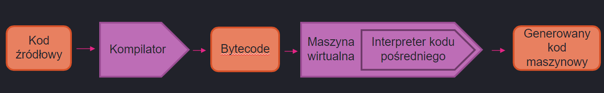
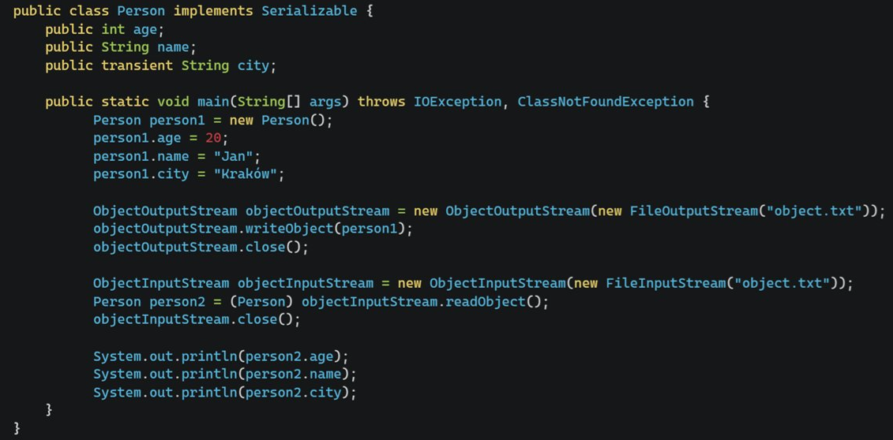
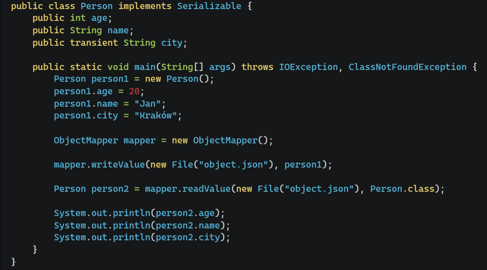

# **Egzamin licencjacki - opracowanie pytań**

### **Java**

[1. Co to jest klasa abstrakcyjna i interfejs w Javie.](#java1) <br>
[2. Proszę omówić dostępne sposoby synchronizacji wątków w Javie.](#java2) <br>
[3. Czy Java jest językiem kompilowanym czy interpretowanym?](#java3) <br>
[4. Co to jest JDBC?](#java4) <br>
[5. Co to jest serializacja? Jak zrealizować serializację w Javie?](#java5) <br>

### **Bazy danych**
[1. Normalizacja baz danych - jej cel i wpływ na wydajność.](#bazy1) <br>
[2. Klucze główne, obce i wyzwalacze.](#bazy2) <br>
[3. Transakcje i zasady ASID.](#bazy3) <br>

### **Język Python**
[1. Programowanie obiektowe w języku Python.](#pyhton1) <br>
[2. Tworzenie i korzystanie z wyjątków w języku Python.](#python2) <br>
[3. Type zmienne i niezmienne, hashowalne i niehashowalne w Pythonie.](#python3) <br>

---

<br>

## <a name=java1></a>
**1. Co to jest klasa abstrakcyjna i interfejs w Javie.**
<br>

**Klasa abstakcyjna**:
- klasa, których obiektów nie możemy tworzyć,
- służy do definiowania cech i zachowań, które są dziedziczone przez jej klasy pochodne,
- jeśli któraś z jej metod jej abstakcyjna, to pochodne klasy muszą ją zaimplementować,
- każda klasa może dziedziczyć tylko z jednej klasy (dotyczy wszystkich klas, nie tylko abstrakcyjnych),
- metody abstrakcyjnie **nie mogą** być oznaczone jako `static` (bo musiałby posiadać implementację wewnątrz klasy abstrakcyjnej, a nie mogą)

*Przykład*:
```java
public abstract class Emeryt {
 	public static final int ILOSC_OCZU = 2; //stałe są ok
 
 	//metoda abstrakcyjna
 	public abstract String krzyczNaDzieci();
 
 	//zwykła metoda z implementacją
 	public static void biegnijDoSklepu(int odleglosc, int predkosc) {
 		double czas = (double)odleglosc/predkosc;
 		System.out.println("Biegne po kiełbase bede za "+czas);
 	}
 }
```
<br>

**Interfejs**:
- określa, co implementująca go klasa musi robić, ale nie wskazuje w jaki sposób,
- może zawierać stałe składowe, jak i zmienne,
- metody zazwyczaj deklaruje się bez podawania żadnego kodu,
- dowolna ilość klas może implementować dany interfejs (poprzez `implements`),
- interfejs może rozszerzać **tylko** interjesy (poprzez `extends`),
- wszystkie <ins>metody interfejsu</ins> są domyślnie **publiczne i abstrakcyjne**,
- wysztkie <ins>pola interfejsu</ins> są domyślnie **publiczne, statyczne i finalne**,
- metody nie mogą być oznaczone jako static (podobnie jak w klasach abstrakcyjnych)

*Przykład*
```java
public interface Pojazd {
 	public void jazda(int predkosc);
 	public void stop();
}

public class Samochod implements Pojazd {
 	@Override
 	public void jazda(int predkosc) { }
 
 	@Override
 	public void stop() { }
 
 	public void drift() { }
}


public class Rower implements Pojazd {
 	@Override
 	public void jazda(int predkosc) { }
 
 	@Override
 	public void stop() { }
 
 	public double skok() { }
}
```
---
<br>

## <a name=java2></a>
**2. Proszę omówić dostępne sposoby synchronizacji wątków w Javie.**
<br>

*<ins>1. Synchronizacja całej metody</ins>*

W danym momencie tylko jedna metoda oznaczona jako `synchronized` może być wykonana przez tylko jeden wątek. Blokada następuje na podstawie obiektu, który wywołał daną metodę.

```java
public class Counter {
    private int value = 0;

    public synchronized void increment() {
        value++;
    }

    public synchronized int getValue() {
        return value;
    }
}
```

Jeśli przez jeden wątek wykonywana jest metoda `increment()`, to metoda `getValue()` nie może zostać wykonana (przez ten sam wątek lub inny) dopóki nie zostanie wykonana metoda `increment()`.

```java
public synchronized void funkcja() {
	... jakies działanie
}

// jest równoważne z 

public void funkcja() {
	synchronized(this) {
		... jakies działanie
	}
}
```

*<ins>2. Synchronizacja na poziomie instrukcji</ins>*

Działa podobnie jak powyższa metoda, lecz tutaj możemy synchronizować <ins>fragmenty</ins> danej metody, a nie całe ciało oraz do synchronizacji nie musimy koniecznie używać obiektu, który wywołuje daną metodę, lecz dowolny obiekt (najczęściej `Object`).

Poniżej przykład ze zliczaniem, gdzie możemy mieć wiele obiektów typu `Counter`, lecz wspólną wartość `value`. Aby synchronizacja zaszła poprawanie to musimy ustalić również wspólny obiekt, który będzie nam blokawał metody dla wątków, które będą chciały się tam dostać (tutaj `lock`).

```java
public class Counter {
    private static int value = 0;
	private static final Object lock = new Object();

    public void increment() {
		synchronized(lock) {
			value++;
		}
    }

    public int getValue() {
		synchronized(lock) {
			return value;
		}
    }
}
```

Jeśli `lock` jest zajęty przez jeden wątek, to inne wątki nie będą mogły wykonać metod, do których synchronizacji wykorzystano ten właśnie obiekt.

*<ins>3. Blokada drobnoziarnista</ins>*

Przykład z dwoma licznikami w jednej klasie - nie używamy ich obu wspólnie, więc nie chcemy blokować drugiego licznika, gdy modyfikujemy pierwszy. W tym celu tworzymy dwa obiekty, które będą nam służyły na locki.

```java
public class DoubleCounter {
	public int v1 = 0;
	public int v2 = 0;

	private static final Object lock1 = new Object();
	private static final Object lock2 = new Object();

	public void increment1() {
		synchronized(lock1) {
			v1++;
		}
	}

	public void increment2() {
		synchronized(lock2) {
			v2++;
		}
	}
}
```

*<ins>4. Operacje atomowe - volatile</ins>*

Operacja atomowa to taka, która nie może zatrzymać się pośrodku - albo się wykonuje całkowicie, albo wcale. Na ogół dostęp do zmiennych/referencji nie jest realizowany jako pojedyncza operacja, więc aby wszystkie te operacje były atomowe, to taką zmienną należy zadeklarować jako `volatile`.

Atomowe są tylko operacje odczytu i zapisu.

*<ins>5. wait() i notify()</ins>*

W momencie gdy wątek musi poczekać, aż inny wątek wykona określoną część swoich zadań stosuje się mechanizm czekania i powiadamiania.

`wait()` – powoduje, że bieżący wątek będzie czekał, aż inny wątek wywoła funkcję notify() dla tego obiektu lub notifyAll()​

`notify(), notifyAll()` – wybudza wątki oczekujące na dostęp do tego obiektu

```java
public synchronized consume() {
	while(!available) {
		try {
			wait(); // wstrzymuje dzialanie watku i zwalnia blokadę
		} 
		catch (InterruptedException e) {}
	}

	System.out.println("Skonsumowane");
	available = false;
}

public synchronized produce() {
	doProduce();
	available = true;
	notifyAll(); // powiadamia (budzi) wszystkie czekajace watki
}
```

*<ins>6. Obiekt Lock</ins>*

Działają podobnie jak słowa kluczowe synchronized, ale dają większą swobodę.

`lock()` - próbuje zdobyć blokadę, jeśli jest dostępna; jeśli nie, wątek **zostanie zablokowany do momentu zwolnienia blokady**

`tryLock()` - próbuje zdobyć blokadę natychmiastowo, zwraca true jeśli się uda, **nie blokuje się**

`unlock()` - odblokowuje instancję blokady

---

## <a name=java3></a>
<br>

**3. Czy Java jest językiem kompilowanym czy interpretowanym?**

Java nie jest językiem kompilowanym oraz nie jest językiem interpretowanym - jest połączeniem tych obu języków.

- najpierw kod źródłowy jest **kompilowany** (polecenie `javac`) do **bytecodu**, który jest niezależny od platformy,
- następnie JVM **interpretuje** (polecenie `java`) dany bytecode w czasie jego wykonania

To JVM jest dostosowana do każdej platformy, która obsługuje Javę, a nie poszczególne programy.




---

<br>

## <a name=java4></a>

**4. Co to JDBC?**

- JDBC (<ins>Java DataBase Conectivity</ins>) jest zbiorem klas i interfejsów używanych do tworzenia aplikacji łączących się z bazami danych.
- Dostarczana jest przez producentów baz co pozwala na ukrycie kwestii technicznych powiązanych z komunikacją z bazą

Istnieją 2 sposoby łączenia się z bazą danych:
1. **DriverManager**:
   -  jest tradycyjną warstwą zarządzającą JDBC pomiędzy użytkownikiem a sterownikiem,
   - napierw wczytujemy sterownik do bazy danych, a następnie za pomocą metody `getConnection` próbujemy uzyskać połączenie z bazą


```java
Class.forName("jdbc.odbc.JdbcOdbcDriver").newInstance();

String url = "jdbc:odbc:bazydanych";
Connection con = DriverManager.getConnection(url, "login", "haslo");
```

2. **DataSource**
   - reprezentuje źródło danych. Zawiera informacje identyfikujące i opisujące dane.
   - brak bezpośredniego odwołania do sterownika przez aplikację,

<br>

*Wykonywanie zapytań*

- executeQuery – pytania zwracające dane: `SELECT`,
- executeUpdate – pytania zmieniające dane: `INSERT, UPDATE, CREATE TABLE`
```java
Statement stmt = con.createStatement();
Result rs = stmt.executeQuery("SELECT imie from Student");

while(rs.next()) {
	System.out.println(rs.getString("imie");
}
```

---

<br>

## <a name=java5></a>
**5. Co to jest serializacja? Jak zrealizować serializację w Javie?**

Serializacja jest to konwersja stanu obiektu na strumień bajtów. Jest ona wykorzystywana m.in. do **zapisywania stanu obiektu**, w celu jego późniejszego odtworzenia. 

W Javie możemy serializować tylko te obiekty, które implementują interfejs `Serializable`. Nie posiada on żadnych metod do zaimplementowania - służy on tylko do oznaczenia, że klasa może być serializowana.

<br>

Aby zrealizować serializację należy użyć klas `ObjectOutputStream` oraz `ObjectInputStream`. Zapis odbywa się za pomocą metody `writeObject()` a odtwarzenie - za pomocą metody `readObject()`.

<br>



<br>

Można również skorzystać z formatu **JSON** .

<br>



---

<br>


## <a name=bazy1></a>
**1. Normalizacja baz danych - jej cel i wpływ na wydajność.**

Normalizacja baz danych to proces projektowania bazy danych w taki sposób, aby **zminimalizować powtarzające się dane i zależności funkcyjne** między nimi. Jej celem jest zapewnienie, że baza danych jest spójna, zintegrowana i łatwa do utrzymania.

Normalizacja baz danych ma szereg zalet:
- Zmniejsza ryzyko niespójności danych.
- Upraszcza operacje dodawania, odczytu, aktualizacji i zapisu do bazy danych.
- Pozwala łatwiej pogrupować dane (np. poprzez wyodrębnienie nowych tabel).
- Zmniejsza ostateczny rozmiar bazy danych poprzez usunięcie duplikatów.

(Mało wyszukany przykład: tabela student i prowadzący, jak mogą wyglądać bez normalizacji, a jak po?)

Trzeba też podkreślić, że celem normalizacji baz danych jest unikanie anomalii:
- **Redundancja** - ta sama informacja jest niepotrzebnie przechowywana w kilku krotkach
- **Anomalia modyfikacji** - informacja zostanie zmodyfikowana w pewnych krotkach, a w innych nie. Która informacja jest wówczas prawdziwa?
- **Anomalia usuwania** - usuwanie części informacji powoduje utratę innej informacji, której nie chcielibyśmy stracić.
- **Anomalia dołączania** - wprowadzenie pewnej informacji jest możliwe tylko wtedy, gdy jednocześnie wprowadzamy jakąś inną informację, która może być obecnie niedostępna.

Wpływ normalizacji na wydajność zależy od stopnia normalizacji. W niektórych przypadkach, szczególnie gdy baza danych jest bardzo duża, normalizacja może prowadzić do spadku wydajności, ponieważ złożone zapytania wymagają łączenia wielu tabel. W innych przypadkach normalizacja może przyspieszyć wykonywanie zapytań, ponieważ baza danych jest bardziej zorganizowana i zminimalizowane są powtarzające się dane.

---

## <a name=bazy2></a>
<br>

**2. Klucze główne, obce i wyzwalacze.**

<ins>**Klucz**</ins> - Mówimy, ze zbiór atrybutów ${\{A_1, A_2, . . . , A_n\}}$ tworzy klucz pewnej tabeli, jeśli wszystkie pozostałe atrybuty z tej tabeli są funkcyjnie zależne od wskazanego zbioru. Dwie różne krotki nie mogą mieć tych samych kluczy. 

<ins>**Klucz obcy**</ins> to atrybut lub kombinacja atrybutów w tabeli, który odwołuje się do **klucza głównego lub unikalnego atrybutu w innej tabeli**. Jego celem jest zapewnienie spójności danych i umożliwienie łączenia tabel. Klucz obcy tworzy zależność między tabelami.

Pozwala to na automatyczne dokonywanie zmian w powiązanych tabelach lub uniemożliwia dokonanie zmian naruszających ograniczenia.

<ins>**Wyzwalacze**</ins> to specjalne procedury w języku SQL, które uruchamiają się automatycznie w odpowiedzi na określone zdarzenia w bazie danych. Mogą to być na przykład zmiany danych w tabeli, wstawianie nowych rekordów lub usuwanie istniejących. Wyzwalacze pozwalają na automatyzację określonych czynności i zapewnienie spójności danych w bazie danych.

Przykłady użyć wyzwalaczy:
- podczas modyfikacji danych: zapisywanie w logach jaki użytkownik zmienił wartość danego atrybutu, o jakim czasie, jaka była stara wartość itp. Któtko mówiąc, służy do **monitorowania** bazy danych,
- kaskada zdarzeń typu `DELETE` lub `UPDATE`: jak usuwamy jakiś wiersz, to usuwamy odpowiadające mu wiersze w innych tabelach

---

<br>

## <a name=bazy3></a>
**3. Transakcje i zasady ASID.**

**<ins>Transakcja</ins>**: sekwencja pewnych operacji na bazie danych, gdzie przeprowadza bazę danych z jednego **spójnego stanu** w **inny spójny stan**. Transakcje muszę przestrzegać zasady ACID.

Spójność bazy danych polega na tym, że serwer przechowujący bazę danych **musi** zwrócić **taką samą odpowiedź** na dane zapytanie, gdyby zadać je w tym samym momencie.

W przypadku *pojedynczego użytkownika*: chcemy uważać na pewne wrażliwe dane, więc użycie transakcji polega na możliwości przywrócenia bazy danych do poprzedniego stanu w przypadku gdy wystąpi jakiś błąd albo szkodliwe działanie.

Natomiast w *systemach wielodostępnych* różne procesy klienckie nie mogą się ze sobą kłócić.

**<ins>Zasady ACID</ins>**: zbiór reguł, które określają, jak powinny działać transakcje.
- **Atomicity (Atomowość)**: transakcja ma być wykonana w całości, albo wcale,
- **Consistency (Spójność)**: transakcja musi zachować spójność bazy danych,
- **Isolation (Izolacja)**: jedna transakcja nie może widzieć wyników działania innej, *niezatwierdzonej* transakcji - wszystkie transakcje są dla siebie niewidoczne,
- **Durability (Trwałość)**: zmiany wprowadzane przez transakcje muszą być trwałe, niezależnie od późniejszych błędów sprzętu lub oprogramowania

Transakcje i zasady ASID są niezbędne do utrzymywania spójności dużych baz danych, w których zapytania i transakcje wykonywane są równolegle przez wielu użytkowników.

---

<br>

## <a name=python1></a>
**1. Programowanie obiektowe w języku Python.**

W języku Python możemy korzystać z paradygmatu programowania obiektowego, które pozwala nam na zebranie pewnych cech i zachowań w jedną całość (klasę).

- **Dziedziczenie** – używanie przez klasę pewnych funkcjonalności z innych klas.​
- **Polimorfizm** – przejawia się w różnym sposobie działania na przykład metod w zależności jaki obiekt je wywoła.​
- **Hermetyzacja (enkapsulacja)** - łączenie danych i metod w pojedynczą jednostkę czyli klasę.​
- **Abstrakcja** – forma uproszczenia problemu, która polega na korzystaniu z uproszczonego zestawu cech danego obiektu, niezależnie od szczegółowej implementacji.

*Konstrukcja typowej klasy w Pythonie:*
```python
class Debil:
	def __init__(self, imie, nazwisko):
		self.imie = imie
		self.nazwisko = nazwisko
		self.__prywatna = "klasa potomna tego nie widzi"
		self._chroniona = "klasy potomne to widzią"

	def __str__(self):
		return self.imie + " " + self.nazwisko

	def __del__(self):
		print("Skasuje gnojka")

	def jakas_funkcja(str):
		print(str)

# dziedziczenie

class Student(Debil, ...):
	def jakas_fukcja(str = "student"):
		super().jakas_funkcja(str)

```

*Mechanizm abstrakcji*
```python
from abc import ABC, abstractmethod
class Zwierze(ABC):
    def __init__(self, nazwa, wiek, waga):
        self.nazwa = nazwa
        self.wiek = wiek
        self.waga = waga
        
    @abstractmethod # tutaj wymuszamy implementację tej metody w klasach pochodnych
    def nazwa_gatunku(self): 
        pass
```

---

<br>

<a name="python2"></a>
**2. Tworzenie i korzystanie z wyjątków w języku Python.**

Wyjątki to zdarzenia, które najczęściej informują nas o pojawieniu się jakiegoś błędu działania naszego programu. Przechwytywanie wyjątków umożliwia nam zmianę przebiegu programu.

- `raise`: ręczne wywołanie wyjątku,
- `try/except/else/finally`: przechwytywanie i obsługiwanie wyjątku

Tworzenie własnych wyjątków polega na utworzeniu klasy, która dziedziczy po klasie `Exception`.

*Przykład*

```python
class AgeException(Exception):
	pass

number = 18

try:
		input_num = int(input("Podaj wiek"))
		if input_num < number:
			raise AgeException
		else:
			pass
except AgeException:
	print("Nieodpowiedni wiek")
```